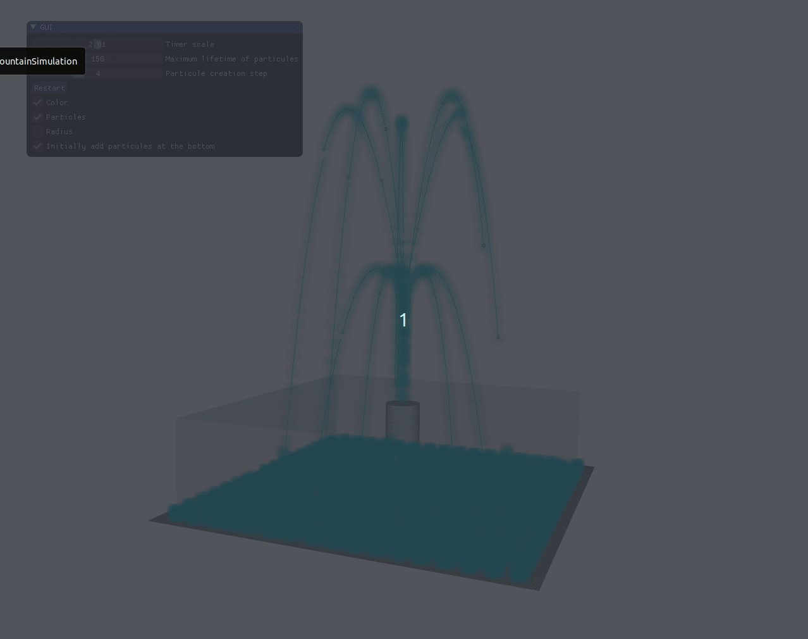

# 3DFountainSimulation



## Run the code

Requirement to be able to run the code:
- C++ compilation tools
- CMake
- GLFW library

On your terminal:

```
cd path/to/folder
mkdir build
cd build
cmake ..
make
cd ..
./build/3DFountainSimulation
```

